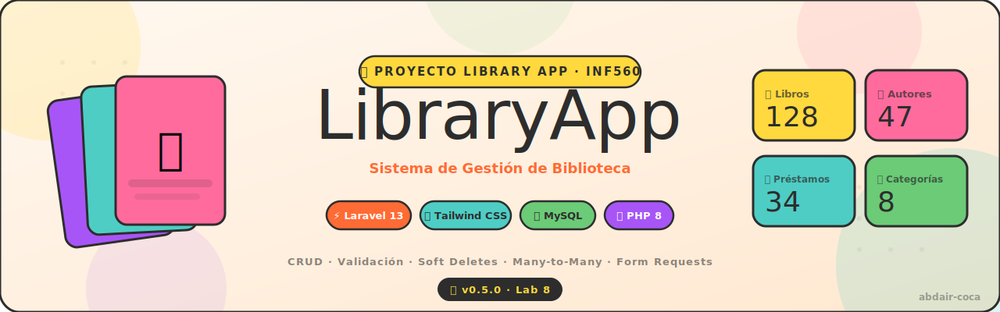
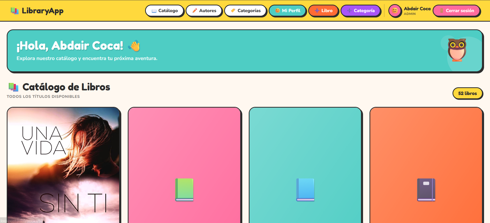
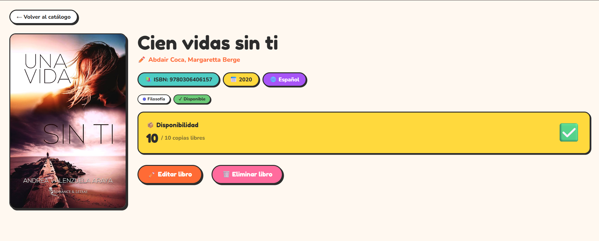
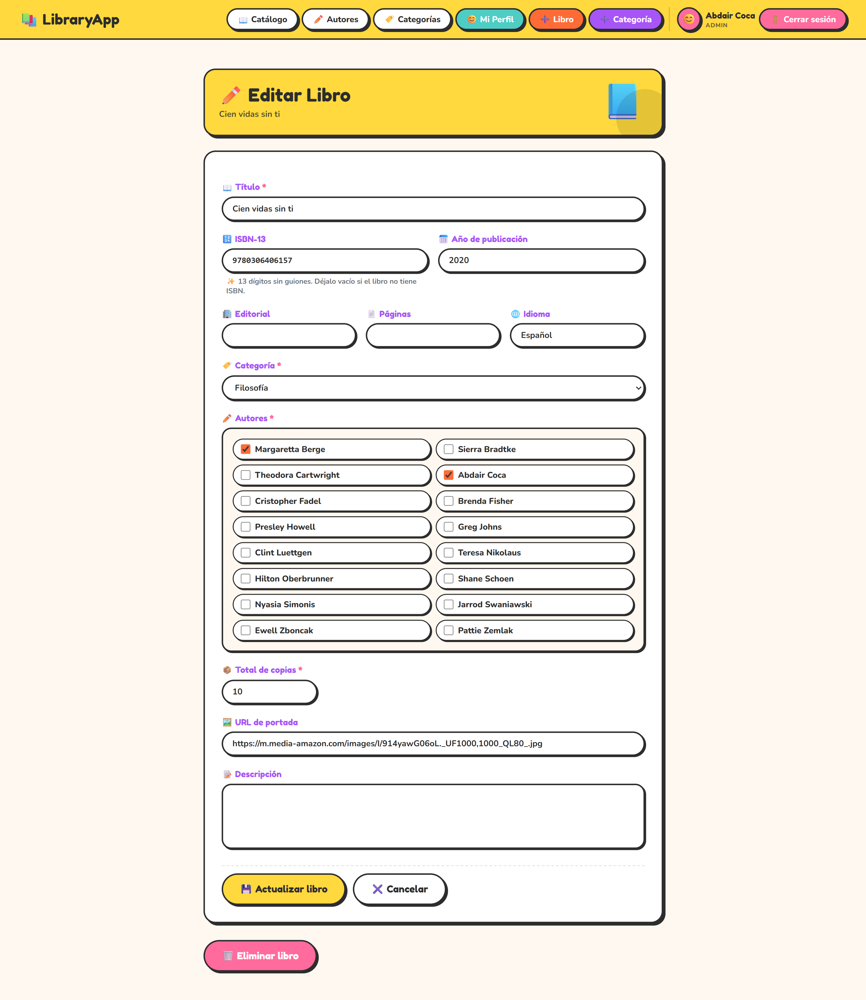
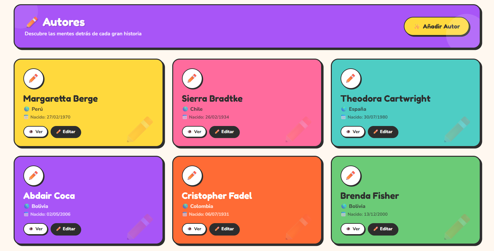
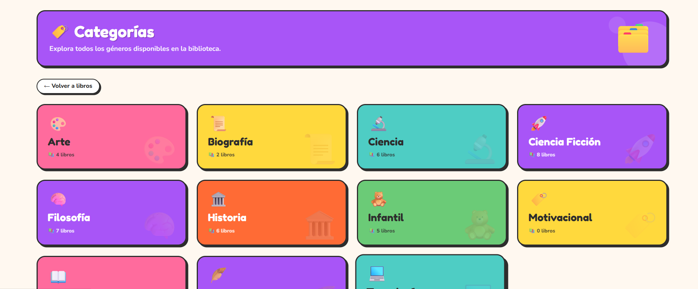
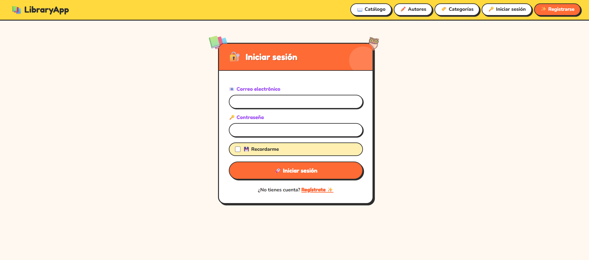

# 📚 Library App

<p align="center">
  
</p>

<p align="center">
  <strong>Full-Stack Library Management System</strong><br>
  Built with Laravel 13, PostgreSQL & TailwindCSS
</p>

<p align="center">
  
  
  
  
  
  
</p>

<p align="center">
  <a href="#-overview">Overview</a> •
  <a href="#-features">Features</a> •
  <a href="#-preview">Preview</a> •
  <a href="#-tech-stack">Tech Stack</a> •
  <a href="#-installation">Installation</a> •
  <a href="#-architecture">Architecture</a> •
  <a href="#-roadmap">Roadmap</a>
</p>

---

# ✨ Overview

**Library App** is a production-ready library management system built on a clean, scalable Laravel architecture. It handles the full lifecycle of a library operation — from book cataloging and member management to loan tracking and access control.

The system was developed incrementally over multiple releases, applying industry-standard backend practices at each stage:

- **Scalable architecture** — RESTful controllers, Form Requests, and layered middleware
- **Data integrity** — custom validation rules, soft deletes, and eager-loaded ORM queries
- **Maintainability** — reusable Blade components, semantic commits, and Git version tagging
- **Security** — role-based authentication and route-level middleware protection

> Built for the course **INF560 — Backend Web Development** at Universidad Autónoma Tomás Frías.

---

# 🎯 Features

<div align="center">

| Feature | Description |
|---|---|
| 📖 Book Management | Full CRUD with ISBN and slug validation |
| ✍️ Authors | Many-to-many relationships with sync support |
| 🏷️ Categories | Flexible book classification system |
| 👤 Members | User and member administration panel |
| 🔁 Loans | Loan tracking with availability logic |
| 🔐 Authentication | Login, role-based access, and middleware guards |
| 🗑️ Soft Deletes | Safe record archiving with restore support |
| ✅ Validations | Form Requests with custom rules (ValidIsbn, ValidSlug) |
| ⚡ Query Optimization | Eager loading and clean Eloquent ORM usage |

</div>

---

# 🖼️ Preview

## 🏠 Dashboard

<p align="center">
  
</p>

---

## 📖 Book Details

<p align="center">
  
</p>

---

## ✏️ Book Form

<p align="center">
  
</p>

---

## 👨‍💼 Authors Management

<p align="center">
  
</p>

---

## 🏷️ Categories

<p align="center">
  
</p>

---

## 🔐 Authentication

<p align="center">
  
</p>

---

# 🧱 Tech Stack

## ⚙️ Backend

- **Laravel 13** — application framework
- **PHP 8.3+** — runtime with modern syntax
- **Eloquent ORM** — expressive database layer
- **Form Requests** — decoupled validation logic
- **RESTful Controllers** — clean resource routing
- **Middleware & Roles** — route-level access control

---

## 🗄️ Database

- **PostgreSQL 14+** — primary relational database
- **Laravel Migrations** — version-controlled schema
- **Seeders & Factories** — reproducible test data

---

## 🎨 Frontend

- **Blade Templates** — server-side rendering
- **TailwindCSS** — utility-first styling
- **Reusable Components** — DRY, composable UI
- **Responsive Design** — mobile-friendly layouts

---

# 🎨 Design System

The UI follows a neo-brutalist aesthetic — vibrant, high-contrast, and deliberately expressive.

### Visual Identity

- 🎨 Bold borders and strong shadows
- 🌈 Saturated color palette with intentional accents
- 🧩 Rounded components with clear visual hierarchy
- ✨ Friendly UX with consistent interaction patterns

### Typography

| Role | Font |
|---|---|
| Display | Fredoka One |
| Body | Nunito |

### Brand Palette

| Color | Role |
|---|---|
| 🟡 Yellow | Highlights & attention |
| 🟠 Orange | Primary actions |
| 🌸 Pink | Accent & branding |
| 🔵 Blue | Information & links |
| 🟣 Purple | Identity & headers |
| 🟢 Green | Success states |

---

# ⚡ Installation

## 📋 Requirements

- PHP 8.3+
- Composer
- PostgreSQL 14+
- Node.js 18+
- Git

---

## 🚀 Quick Setup

### 1️⃣ Clone the Repository

```bash
git clone https://github.com/abdair-coca/Library_App.git
cd Library-App
```

---

### 2️⃣ Set Up Environment

```bash
cp .env.example .env
```

---

### 3️⃣ Install PHP Dependencies

```bash
composer install
```

---

### 4️⃣ Generate Application Key

```bash
php artisan key:generate
```

---

### 5️⃣ Configure PostgreSQL

Create the database:

```sql
CREATE DATABASE library_db;
```

Update your `.env`:

```env
DB_CONNECTION=pgsql
DB_HOST=127.0.0.1
DB_PORT=5432
DB_DATABASE=library_db
DB_USERNAME=postgres
DB_PASSWORD=your_password
```

---

### 6️⃣ Run Migrations and Seeders

```bash
php artisan migrate --seed
```

---

### 7️⃣ Build Frontend Assets

```bash
npm install
npm run dev
```

---

### 8️⃣ Start the Development Server

```bash
php artisan serve
```

Application available at:

```
http://localhost:8000
```

---

# 🧭 Useful Commands

## 📌 Routes

```bash
php artisan route:list
```

## 🗄️ Database

```bash
php artisan migrate
php artisan migrate:refresh --seed
```

## ⚡ Cache

```bash
php artisan cache:clear
php artisan config:clear
```

## 🏗️ Code Generation

```bash
php artisan make:model Book -m
php artisan make:controller BookController --resource
php artisan make:request StoreBookRequest
php artisan make:seeder BookSeeder
```

## 🧪 REPL

```bash
php artisan tinker
```

---

# 🧩 Architecture

```
app/
├── Http/
│   ├── Controllers/       # RESTful resource controllers
│   ├── Requests/          # Form Request validation classes
│   └── Middleware/        # Auth and role guards
│
├── Models/                # Eloquent models with relationships
│
├── Rules/                 # Custom validation rules (ValidIsbn, ValidSlug)
│
resources/
├── views/
│   ├── books/
│   ├── authors/
│   ├── categories/
│   ├── members/
│   ├── loans/
│   └── components/        # Reusable Blade components
│
database/
├── migrations/            # Version-controlled schema
├── seeders/               # Demo and test data
└── factories/             # Model factories for testing
```

---

# 📚 Release History

| Version | Guide | Focus |
|---|---|---|
| v0.1.0 | Guide 4 | Laravel setup + PostgreSQL integration |
| v0.2.0 | Guide 5 | Eloquent models and relationships |
| v0.3.0 | Guide 6 | RESTful controllers and Blade views |
| v0.4.0 | Guide 7 | Full CRUD, soft deletes, Blade partials |
| v0.5.0 | Guide 8 | Form Requests and custom validation rules |
| v0.6.0 | Guide 9 | Authentication, roles, and middleware |

---

# ✅ Engineering Practices

- RESTful conventions and resource routing
- Clean architecture with separation of concerns
- Decoupled validation via Form Request classes
- Custom validation rules (`ValidIsbn`, `ValidSlug`)
- Reusable Blade components for DRY templates
- Eager loading to prevent N+1 query problems
- Flash messages and structured error handling
- Semantic commit messages
- Git version tagging at each milestone

---

# 🧪 Testing

Run the full test suite:

```bash
php artisan test
```

Or directly with PHPUnit:

```bash
vendor/bin/phpunit
```

---

# 📂 Documentation Assets

```
docs/
├── assets/
│   └── library-banner.svg
│
└── screenshots/
    ├── dashboard.png
    ├── book-show.png
    ├── book-form.png
    ├── authors-index.png
    ├── categories-index.png
    └── auth-login.png
```

---

# 🤝 Contributing

Pull requests are welcome. For major changes, please open an issue first to discuss what you'd like to change.

```bash
# Fork the repository

# Create a feature branch
git checkout -b feature/your-feature-name

# Commit your changes
git commit -m "feat: add your feature description"

# Push and open a Pull Request
git push origin feature/your-feature-name
```

---

# 📄 License

This project is licensed under the **MIT License** — see [`LICENSE`](LICENSE) for details.

---

# 👨‍💻 Author

**Abdair Magdiel Coca Carlo**

- GitHub: [@abdair-coca](https://github.com/abdair-coca)
- Course: INF560 — Backend Web Development
- Institution: Universidad Autónoma Tomás Frías (UATF), Potosí, Bolivia

---

<p align="center">
  <strong>Built with Laravel ❤️ — clean architecture, vibrant design 📚✨</strong>
</p>