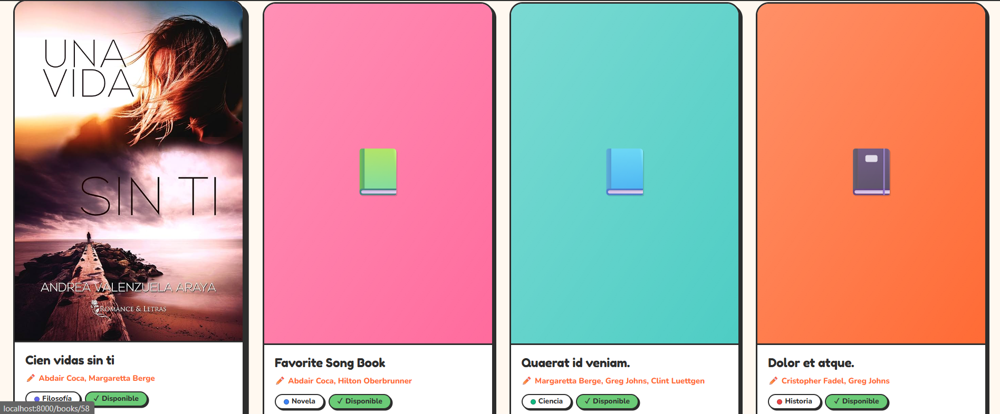

# 📚 Library App  
### Sistema de Gestión de Biblioteca — *INF560 Backend Web*

<p align="center">
  
  
  
  
  
</p>

<p align="center">
  <strong>Estilo visual:</strong> Divertido & Colorido 🎨 · Neo-brutalist ✨ · UX amigable 🫶
</p>

---

## ✨ Descripción

**Library App** es una aplicación web para la gestión integral de biblioteca construida con **Laravel 13**, **PHP 8.3+** y **PostgreSQL**.  
El proyecto fue desarrollado de forma **incremental por guías de laboratorio**, evolucionando desde la configuración inicial hasta una arquitectura robusta con buenas prácticas backend y frontend.

### Objetivo funcional
Permitir administrar:

- 📖 Libros  
- ✍️ Autores  
- 🏷️ Categorías  
- 👤 Miembros  
- 🔁 Préstamos  
- 🔐 Usuarios y autenticación por roles

---

## 🖼️ Vista de la Aplicación (espacios para imágenes)


### 1) Dashboard principal
<p align="center">
  
</p>

---

### 2) Listado de libros
<p align="center">
  
</p>

---

### 3) Detalle de libro
<p align="center">
  
</p>

---

### 4) Formulario de creación/edición
<p align="center">
  
</p>

---

### 5) Gestión de autores
<p align="center">
  
</p>

---

### 6) Categorías
<p align="center">
  
</p>

---

### 7) Pantalla de login
<p align="center">
  
</p>

---

## 🧠 Contexto Académico

- **Materia:** INF560 — Desarrollo Web Backend  
- **Universidad:** Universidad Autónoma Tomás Frías (UATF), Potosí - Bolivia  
- **Docente:** M. Sc. Huáscar Fedor Gonzales Guzmán

---

## 🧱 Stack Tecnológico

### Backend
- Laravel 13
- PHP 8.3+
- Eloquent ORM
- Form Requests / Validaciones personalizadas

### Base de datos
- PostgreSQL 14+
- Migraciones y seeders

### Frontend
- Blade Templates
- Tailwind CSS
- Componentes reutilizables

---

## 🎨 Identidad de Diseño (alineada al proyecto)

Este repositorio sigue un diseño:

- **Divertido y colorido**
- **Tipografías:** Fredoka One + Nunito
- **Paleta brand:** amarillo, naranja, rosa, azul, púrpura, verde
- **Sombras neo-brutalist:** bordes marcados y sombras desplazadas

> Esta identidad visual ayuda a que la experiencia sea más humana, clara y memorable.

---

## ⚙️ Requisitos Previos

- PHP 8.3+
- Composer
- PostgreSQL 14+
- Git
- Node.js 18+ (opcional para assets)

### Verificación rápida

```bash
php --version
composer --version
psql --version
git --version
node --version
🚀 Instalación Rápida
# 1) Clonar repositorio
git clone https://github.com/HuascarFedor/INF560_libraryApp.git
cd INF560_libraryApp

# 2) Variables de entorno
cp .env.example .env

# 3) Instalar dependencias PHP
composer install

# 4) Generar clave
php artisan key:generate

# 5) Ejecutar migraciones + seeders
php artisan migrate --seed

# 6) (Opcional) Frontend
npm install
npm run dev

# 7) Levantar servidor local
php artisan serve
Aplicación disponible en:
👉 http://localhost:8000

🗄️ Configuración de Base de Datos (PostgreSQL)
Crea una base de datos local:

CREATE DATABASE library_db;
Ejemplo mínimo para .env:

DB_CONNECTION=pgsql
DB_HOST=127.0.0.1
DB_PORT=5432
DB_DATABASE=library_db
DB_USERNAME=postgres
DB_PASSWORD=tu_contraseña
🧭 Comandos Útiles
# Rutas
php artisan route:list

# Migraciones
php artisan migrate
php artisan migrate:refresh --seed

# Cache
php artisan cache:clear
php artisan config:clear

# Generadores
php artisan make:model NombreModelo -m
php artisan make:controller NombreController --resource
php artisan make:seeder NombreSeeder

# REPL
php artisan tinker
🧩 Arquitectura Funcional (resumen)
Books: CRUD completo, soft delete, validaciones y relación con autores/categorías.

Authors: gestión y asociación Many-to-Many.

Categories: clasificación de libros.

Loans: reglas de negocio para disponibilidad y préstamo.

Auth: login/registro, middleware y control por roles.

📚 Evolución por Guías (Roadmap Académico)
Guía	Tag	Enfoque principal
Guía 4	v0.1.0	Setup Laravel + PostgreSQL + migraciones base
Guía 5	v0.2.0	Modelos, relaciones Eloquent, factories/seeders
Guía 6	v0.3.0	Rutas REST, controladores y vistas Blade
Guía 7	v0.4.0	CRUD completo con formularios y soft delete
Guía 8	v0.5.0	Validación avanzada con Form Requests
Guía 9	v0.6.0	Autenticación, middleware y roles
✅ Buenas Prácticas Aplicadas
Convenciones RESTful

Separación de responsabilidades (Controllers / Requests / Models)

Eager loading para optimización de consultas

Reutilización de componentes Blade

Manejo de errores y mensajes flash

Versionado por tags de hitos

🧪 Testing
php artisan test
Si usas PHPUnit directo:

vendor/bin/phpunit
📂 Estructura sugerida para assets del README
docs/
└── screenshots/
    ├── dashboard.png
    ├── books-index.png
    ├── book-show.png
    ├── book-form.png
    ├── authors-index.png
    ├── categories-index.png
    └── auth-login.png
🤝 Contribución
Si quieres colaborar:

Haz un fork del proyecto

Crea una rama: feature/mi-mejora

Commit: feat: agrega mejora X

Push y abre Pull Request

📄 Licencia
Define aquí tu licencia (MIT, Apache-2.0, etc.).
Si el proyecto es solo académico, indícalo explícitamente.

👨‍💻 Autor
Desarrollado para la materia INF560 con enfoque en buenas prácticas de backend y una experiencia visual amigable para usuarios finales.

<p align="center"> Hecho con Laravel ❤️ + diseño colorido 📚✨ </p> ```